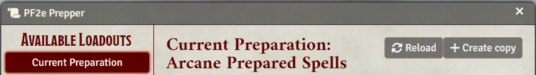
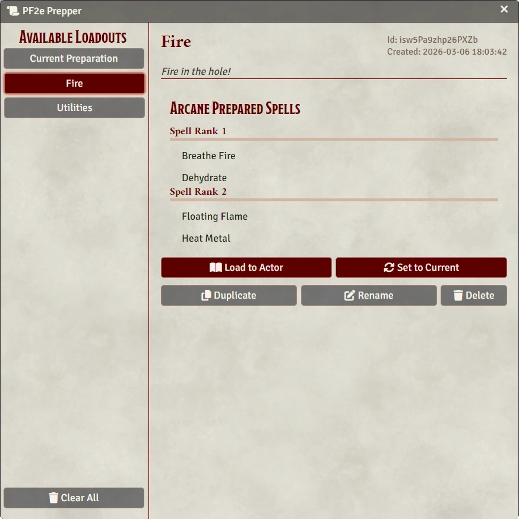

# PF2e Prepper

Save, load, and manage multiple prepared spell loadouts per in Pathfinder 2e.

## What It Does
- Saves prepared spell entries' spells, with name and description (a "Loadout")
    - Supports both standard **prepared casting** and **flexible casting**
- Put a Loadout back onto the actor's spell entry
- Stores Loadout per spellcasting entry (important for e.g. Dedications)
- List management: create, duplicate, rename, reset-to-current, delete

## Installation
1. In Foundry, open **Add-on Modules**.
2. Click **Install Module**.
3. Search for PF2e Prepper  
    or  
Paste this manifest URL:
   - `https://github.com/robinsving/pf2e-prepper/releases/latest/download/module.json`
4. Install and enable the module in your world.

## Usage
### 1. Open the manager from a spell entry
On a prepared spellcasting entry, click the scroll button.


### 2. Current preparation view
From the current tab you can:
- **Reload** the current display
- **Create copy** (save current prep as a new loadout)



### 3. Manage saved spells
Select a Loadout and use:
- **Load to Actor**
- **Set to Current** (replace saved loadout content with current prep)
- **Duplicate**
- **Rename**
- **Delete**

Use **Clear All** at the bottom of the left tab rail to remove all saved loadouts for the actor.



## Notes
- Loadouts are stored in actor flags under this module.
- Loading a loadout replaces current prepared slots/signatures for that spellcasting entry.
- If a saved spell no longer exists (or cannot be applied), the module shows a warning popup with spell names and reasons.

## Troubleshooting
- If the manager button does not appear, verify the actor has a prepared spellcasting entry.
- If spells are skipped on load, check the warning popup for details (missing/deleted spell, bad saved data, rank slot mismatch).

## Development
- Test suite: `npm test`
- Main storage logic: `prepper/PrepperStorage.js`
- Main app/UI logic: `prepper/PrepperApp.js`

## Integration with the Prepper API
For module developers looking to integrate. All API calls require an `Actor` instance (not an ID).

Fetch all prepared spellcasting entries on an actor:
```js
const prepper = game.modules.get("pf2e-prepper")?.api;
const entries = prepper.getPreparedSpellcastingEntries(actor);
// [{ id, name, flexible, hasLoadouts }]
```

Fetch loadouts for a specific spellcasting entry:
```js
const loadoutsById = prepper.getSpellLoadouts(actor, spellcastingEntryId);
// { [loadoutId]: loadout }
```

Load a selected loadout onto the actor:
```js
const success = await prepper.loadSpellLoadout(actor, spellcastingEntryId, loadoutId);
```


## Support
- Issues: https://github.com/robinsving/pf2e-prepper/issues
